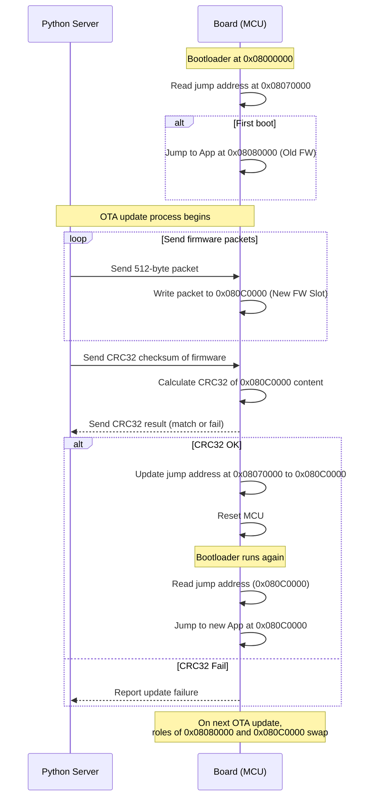

# STM32 B-L475E OTA Bootloader

This repository contains an **Over-The-Air (OTA) bootloader** for the  
[ST B-L475E-IOT01A](https://www.st.com/en/evaluation-tools/b-l475e-iot01a.html) IoT discovery board.

The bootloader allows the board to:

- Start a **TCP server** over the onboard Wi-Fi module  
- Receive a **binary firmware file** from a host (via Python client)  
- Store the binary in internal Flash memory  
- Jump to and run the newly received application  
- Runs old firmware if CRC32 checksum is failed

This project demonstrates a minimal OTA update mechanism for IoT devices.

---

## Features

- TCP/IP server for binary transfer  
- Python client for sending firmware updates  
- Bootloader with application jump logic  
- Example application: **LED blink** in a custom pattern  
- Extensible design for future security and reliability improvements  

---

## Project Structure

```
.
├── Bootloader/       # Bootloader source code
├── Application/      # Example app (LED blink)
├── PythonClient/     # Python script for firmware upload
└── README.md
```

---

## Hardware Requirements

- **Board:** B-L475E-IOT01A  
- **Programmer:** ST-LINK/V2-1 (integrated on the board)  
- **Interface:** Onboard Wi-Fi (SPWF04SA module)  

## Software Requirements

- **Build:** make, cmake (needed for build_all.sh)
- **Compiler:** arm-none-eabi-gcc (tested to work with version 10) 
- **Flashing:** `STM32_Programmer_CLI` executable in path named stm_prog (needed for flash.sh to work)

---

## Usage

#### 1. Building all the binaries

- While in the project root directory run:
```
./Scripts/build_all.sh
```
- A directory binaries will be created with all of the compiled applications.

#### 2. Flashing onto the borad

- Flash by running the following script:

```
./Scripts/flash.sh
```
- This will flash the following:
    - bootloader to 0x08000000 in flash memory
    - addresses of old and new firmware to 0x08070000
    - initial WiFi firmware to 0x08080000

#### 3. Connect python client 

- Update the `tcp_transfer_client.py` with the appropriate ip
- Update the path to the new firmware in the python script (default `binaries/WIFI_OTA_2.bin`) 
- run it with `python3 PythonClient/tcp_transfer_client.py`
- The following is a demonstration of the inputs on stdin to transfer the firmware
- Note: `>` is where user input goes

```
# writing 0 will output the addresses of the 
# currently booted firmware and where the 
# new firmware will be written

> 0
Received: 0x08080000, 0x080C0000

# writing 1 starts the transfer of the binary
# the string confirm is outputted for each received package

> 1
Confirm.
...
Confirm.

# 2 Sends the crc32 checksum, and the board confirms the checksum
> 2
crc32 = e7f1aab2
Received: Confirming crc.

# 5 reboots the board
> 5

> 0
Received: 0x080C0000, 0x08080000

```

---

## Seqeunce diagram of usage



--- 

## Configuration

- **Starting application(old firmware) start address:** `0x08080000`  
- **TCP port:** defined in `Application/OldFirmware/WiFi_Client_Server/Src/main.c`  
- **Wi-Fi SSID/password:** defined in `Application/OldFirmware/WiFi_Client_Server/Src/main.c`  

---

## Roadmap

- [x] Add CRC32 integrity check  
- [ ] Secure OTA with signatures and encryption  
- [ ] Add versioning and rollback support  

---

## License

Released under the MIT License. See [LICENSE](LICENSE) for details.  

---

## Acknowledgments

- [STMicroelectronics STM32CubeL4](https://github.com/STMicroelectronics/STM32CubeL4)  
- STM32 community examples and application notes  
